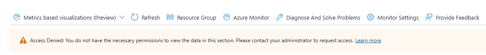
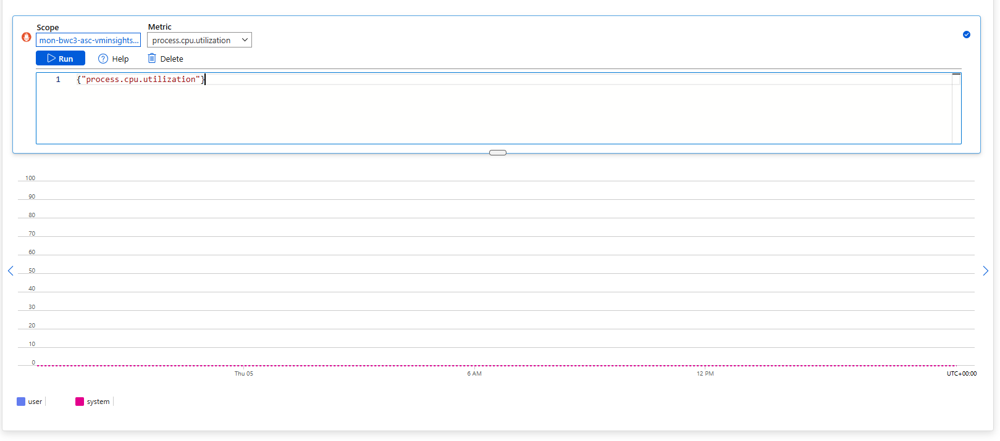

# Modernising Azure Virtual Machine Metrics with OpenTelemetry

## Introduction

VM insights in Azure Monitor currently stores performance data collected from the client in a Log Analytics workspace and uses this data to populate visualizations in the Azure portal. With the release of OpenTelemetry (OTel) system metrics, VM insights is being transitioned to a more cost-effective and efficient method of collecting and visualize system-level metrics. This article describes how to get started using OpenTelemetry metrics as your primary visualization tool.

OTel guest OS metrics are system and process‑level performance counters collected from inside a VM. This includes CPU, memory, disk I/O, network, and per‑process details such as CPU percent, memory percent, uptime, and thread count. This level of visibility helps you diagnose issues without logging into the VM.

### Benefits of OpenTelemetry for VM insights

Benefits of the new OTel-based collection pipeline include the following:

| Benefit                    | Description                                                                                                                                              |
|----------------------------|----------------------------------------------------------------------------------------------------------------------------------------------------------|
| Unified data model         | Consistent metric names and schema across Windows and Linux for easier, reusable queries and dashboards.                                                  |
| Richer, simplified counters| More system and process metrics, including per-process CPU, memory, disk I/O, and consolidation of legacy counters into clearer OpenTelemetry metrics.   |
| Easy onboarding            | Collect OpenTelemetry metrics with minimal setup.                                                                                                         |
| Flexible visualization     | Use the Azure portal, Metrics Explorer, or Azure Monitor Dashboards with Grafana.                                                                        |
| Cost-efficient performance | Store metrics in Azure Monitor Workspace instead of Log Analytics ingestion for lower cost and faster queries.                                           |


Microsoft Documentation: [Link Here](https://learn.microsoft.com/en-gb/azure/azure-monitor/vm/vminsights-opentelemetry)

## Comparing Virtual Machine Insights to Open Telemetry Metrics

| Area                 | Virtual Machine Insights (AMA – Legacy)                         | OpenTelemetry Metrics (VM Insights OTel)                           |
| -------------------- | --------------------------------------------------------------- | ------------------------------------------------------------------ |
| **Data model**       | Windows and Linux use different counters and naming conventions | Unified, consistent metric schema across Windows and Linux         |
| **Metric richness**  | Relies heavily on legacy performance counters                   | Richer system and per-process metrics (CPU, memory, disk, network) |
| **Standards**        | Azure-specific implementation                                   | Open standard (OpenTelemetry), portable and future-proof           |
| **Query experience** | KQL-centric, log-based queries                                  | Native metrics experience with faster, simpler queries             |
| **Cost model**       | Log Analytics ingestion can become expensive at scale           | Metrics stored in Azure Monitor Workspace → lower cost             |
| **Performance**      | Log ingestion and querying can add latency                      | Optimised for metrics: faster ingestion and retrieval              |
| **Visualization**    | Azure Workbooks and Log Analytics focused                       | Azure Portal, Metrics Explorer, Azure Monitor Dashboards, Grafana  |
| **Onboarding**       | More configuration and agent tuning                             | Minimal setup, simpler enablement                                  |
| **Extensibility**    | Limited beyond built-in counters                                | Extensible and aligns with broader observability strategy          |
| **Future direction** | Functional but increasingly legacy                              | Strategic direction for Azure monitoring going forward             |


## Deployment

> [!NOTE]
> Deployment time is around 10 minutes

``` pwsh
.\Invoke-AzDeployment.ps1 -targetScope 'sub' -subscriptionId <subscriptionId> -customerName 'bwc' -environmentType 'dev' -location 'westeurope'  -deploy
```

## Findings and Investigation

During the investigative stage of searching the Open Telementary setup, Found out the hard way that for the Metrics to be pushed to the Azure Monitor Workspace, you need to enable the `System Assigned Managed Identity`.

Otherwise you run into this error message:



Once you have the `System Assigned Managed Identity` enabled, If you check the Monitor tab straight after the deployment, You'll see it. You need to wait about 15 minutes post deployment and then the monitor tab will load and show live metrics.

## Azure Monitor Metrics
Once you've got data spending to the Azure Monitor workspace, From the menu select `Metrics`



Below is a list of the Otel Metrics we are currently polling from the Data Collection Rule

``` bicep
counterSpecifiers: [
    // https://learn.microsoft.com/en-us/azure/azure-monitor/vm/vminsights-opentelemetry#additional-metrics
    'system.filesystem.usage'
    'system.disk.io'
    'system.disk.operation_time'
    'system.disk.operations'
    'system.memory.usage'
    'system.network.io'
    'system.cpu.time'
    'system.network.dropped'
    'system.network.errors'
    'system.uptime'
    'system.cpu.utilization'
    'system.cpu.logical.count'
    'system.cpu.physical.count'
    'system.cpu.frequency'
    'system.cpu.load_average.1m'
    'system.cpu.load_average.5m'
    'system.cpu.load_average.15m'
    'system.memory.utilization'
    'system.memory.limit'
    'system.memory.page_size'
    'system.linux.memory.available'
    'system.linux.memory.dirty'
    'system.paging.faults'
    'system.paging.operations'
    'system.paging.usage'
    'system.paging.utilization'
    'system.disk.io_time'
    'system.disk.merged'
    'system.disk.pending_operations'
    'system.disk.weighted_io_time'
    'system.filesystem.utilization'
    'system.filesystem.inodes.usage'
    'system.network.packets'
    'system.network.connections'
    'system.network.conntrack.count'
    'system.network.conntrack.max'
    'process.uptime'
    'process.cpu.time'
    'process.cpu.utilization'
    'process.memory.usage'
    'process.memory.virtual'
    'process.memory.utilization'
    'process.disk.io'
    'process.disk.operations'
    'process.paging.faults'
    'process.open_file_descriptors'
    'process.threads'
    'process.handles'
    'process.context_switches'
    'process.signals_pending'
    'system.processes.count'
    'system.processes.created'
]
```
